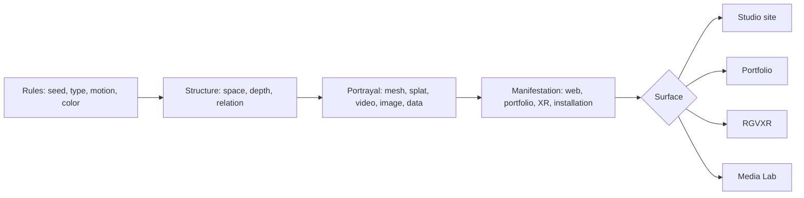
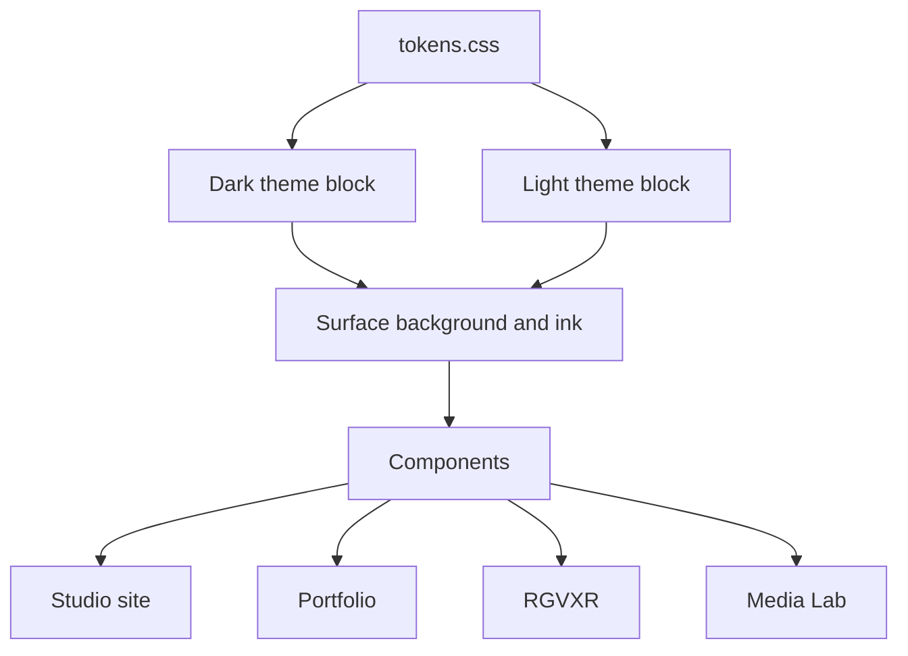
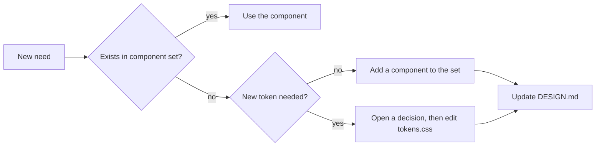

# DESIGN.md - Hypergraphia Interface Contract

<!-- impeccable:design-schema 1 -->

Status: active
Owner: main integration agent
Applies to: every Hypergraphia app, website, and tool

## 1. Purpose

This file is the single contract for interface work.

Every surface uses one token set and one component set.

The contract stops drift between the studio site, the portfolio, and the tools.

A new surface adds pages and layouts. A new surface does not add tokens.

## 2. Scope

| Surface | Location | Stack | Theme |
| --- | --- | --- | --- |
| Hypergraphia Studio site | `work/hypergraphia-site` | static HTML, CSS, Three.js | dark and light |
| Juan Licerio portfolio | `work/jlicerio-portfolio` | static HTML, CSS | dark and light |
| RGVXR gallery | `work/rgvxr` | static HTML, CSS, Three.js, MindAR | dark |
| XR Sandbox Media Lab | `/Users/selfsim/Self-sim/xr-sandbox` | React, TypeScript, Vite | dark |
| Studio documents and proposals | `work/grant-readiness` | Markdown, HTML | dark and light |

The contract covers four identities from the universal identity specification:
Juan Licerio, Hypergraphia Studio, each project, and the XR Sandbox tool.

## 3. Identity Model

The identity comes from the construct.

The construct keeps four stable layers. Only the last layer changes per surface.

The grammar stays constant. The portrayal changes.

## 4. Token Contract

One file holds the tokens. No other file holds a raw color value.

Token names come from `work/hypergraphia-site/system-demo.html`.

### 4.1 Core tokens

| Token | Dark value | Light value | Role |
| --- | --- | --- | --- |
| `--bg` | `#0b0d0f` | `#f2f2ef` | Page background |
| `--surface` | `#111519` | `#ffffff` | Panel background |
| `--surface-raised` | `#171e23` | `#e8e9e6` | Raised panel |
| `--surface-soft` | `#202a31` | `#dcdfdd` | Active or hover fill |
| `--ink` | `#f3f1eb` | `#111416` | Primary text |
| `--muted` | `#9da8ae` | `#59636a` | Secondary text |
| `--quiet` | `#6f7b82` | `#78838a` | Tertiary text |
| `--line` | `rgba(243,241,235,.18)` | `rgba(17,20,22,.18)` | Divider |
| `--line-strong` | `rgba(243,241,235,.34)` | `rgba(17,20,22,.34)` | Border |
| `--shadow` | `0 24px 80px rgba(0,0,0,.32)` | `0 24px 80px rgba(17,20,22,.12)` | Elevation |

### 4.2 Status tokens

| Token | Value | Meaning |
| --- | --- | --- |
| `--info` | `#5fddf4` | Neutral notice |
| `--success` | `#74e1a2` | Confirmed state |
| `--warning` | `#f4c86b` | Attention needed |
| `--danger` | `#ff8f77` | Failure |

Status tokens stay separate from identity accents.

### 4.3 Shape and type tokens

| Token | Value | Role |
| --- | --- | --- |
| `--unit` | `4px` | Base spacing step |
| `--radius-sm` | `8px` | Control radius |
| `--radius-md` | `14px` | Panel radius |
| `--radius-lg` | `22px` | Section radius |
| `--display` | `"Space Grotesk", system-ui, sans-serif` | Headings |
| `--mono` | `"DM Mono", ui-monospace, monospace` | Metadata and values |

Body copy uses Inter or the system sans stack.

## 5. Color Rules

Black and white form the foundation. Light mode inverts the surface.

| Rule | Statement |
| --- | --- |
| R1 | All interface text uses `--ink`, `--muted`, or `--quiet` only. |
| R2 | Status color marks a dot, a border, or a fill. Status color never colors text. |
| R3 | Generative color lives inside a canvas or a scene. Generative color never leaks into chrome. |
| R4 | Both themes keep the same semantic roles and pass contrast checks. |

The current CSS holds `--studio-accent` (`#b99cff`) and `--system-accent` (`#f7734a`).

The confirmed direction is monochrome. Section 12 lists this item as an open decision.

## 6. Typography Scale

| Role | Family | Size | Weight | Tracking |
| --- | --- | --- | --- | --- |
| Display | `--display` | `clamp(26px, 3vw, 44px)` | 550 | `-0.045em` |
| Section head | `--display` | `20px` | 500 | `-0.02em` |
| Body | Inter | `15px` | 400 | `0` |
| Control | Inter | `13px` | 500 | `0.04em` |
| Eyebrow | Inter | `11px` | 700 | `0.18em`, uppercase |
| Metadata | `--mono` | `10px` | 400 | `0.08em` |

Display type never replaces control text.

## 7. Component Set

One component behaves the same way on every surface.

| Component | Purpose | Required states |
| --- | --- | --- |
| `TabBar` | Switch a section or a mode | default, hover, active, focus, disabled |
| `InfoPanel` | Show titled detail blocks | default, empty, loading |
| `ProjectCard` | Link a project to its case study | default, hover, focus |
| `ProjectMeta` | Show verified facts and dates | default, unverified |
| `AssetList` | List files with type and size | default, empty, error |
| `StatusPill` | Show `WAITING`, `LIVE`, `STALE`, `ENDED`, `ERROR` | all five |
| `LaunchSheet` | Start a build or a run | default, running, blocked |
| `QRLaunchPanel` | Show a scan target for a test | default, expired |
| `ThemeToggle` | Switch dark and light | dark, light |
| `Field` | Collect one labelled value | default, focus, invalid |
| `Button` | Trigger one action | primary, quiet, disabled |
| `CanvasFrame` | Hold a render with a caption | default, empty |
| `LoadingState` | Mark pending work | inline, full |
| `ErrorState` | Mark failed work with one recovery step | default |
| `XRCarousel`, `ARButton`, `ProgressDots`, `PreviousNextControls` | Carry the RGVXR interaction quality | inherited from RGVXR |

Component API rules:

1. A component reads tokens only. A component never hardcodes a color or a size.
2. A component receives content as text or nodes. A component never fetches data.
3. A component exposes `data-state` for tests and for styling.
4. A component supports keyboard focus and reduced motion.

## 8. Layout and Spacing

Spacing uses `--unit` multiples: 4, 8, 12, 16, 24, 40, 72.

| Layout | Rule |
| --- | --- |
| Shell | Full-height flex column with one scroll region |
| Split | Content pane plus inspector of `360px` |
| Max width | `1500px` for tools, `1200px` for editorial pages |
| Scroll | One scroll container per view |

The Media Lab shell already follows this layout.

## 9. Theme Modes

Dark mode is the default. Light mode inverts surface tokens only.

A theme switch changes CSS custom properties. A theme switch never changes markup.

## 10. Platform Mapping

Each stack consumes the same tokens through a thin adapter.

| Stack | Consumption method |
| --- | --- |
| Static HTML and CSS | Link `tokens.css` and use `var()` |
| React and TypeScript | Import `tokens.css` at the app root |
| Three.js scene | Read the trait object once at start |
| Canvas and WebGL | Read computed pixel colors from the trait object |

The scene reads one trait object. The trait object carries background, ink, and accent.

This rule keeps a render and its page in one visual family.

## 11. Governance

Rules for contributors:

1. Read this file before interface work.
2. Never copy a token block into a new file.
3. Never fork a component for one surface.
4. Update this file in the same change as the component.
5. Record every new token in the token table.

## 12. Open Decisions

| Item | Current state | Needed action |
| --- | --- | --- |
| Accent colors | `--studio-accent` and `--system-accent` exist | Confirm monochrome or confirm accent use |
| Canonical token file | Site and tool CSS hold separate values | Create one `hypergraphia-system` token file |
| Media Lab tokens | `media-lab.css` uses raw hex values | Replace raw values with tokens |
| Media Lab light mode | Dark only | Add light theme when the studio site needs it |
| Shared package | Does not exist | Create `hypergraphia-system` for tokens and primitives |

## 13. Adoption Checklist

1. The surface links the canonical token file.
2. The surface holds no raw color value outside the token file.
3. The surface uses the shared component set.
4. The surface passes keyboard navigation with visible focus.
5. The surface honors reduced motion.
6. The surface passes contrast checks in both themes.
7. The surface shows real content with verified dates and links.

## 14. References

- [Universal identity and component system](./work/hypergraphia-site/docs/superpowers/specs/2026-09-17-universal-identity-system-design.md)
- [Generative identity system](./work/hypergraphia-site/docs/superpowers/specs/2026-09-17-generative-identity-system-design.md)
- [Generative identity research](./work/hypergraphia-site/docs/research/2026-09-17-generative-identity-and-immersive-studios.md)
- [Generative lab roadmap](./work/hypergraphia-site/docs/roadmaps/2026-09-17-generative-lab-readiness.md)
- [Product definition](./PRODUCT.md)
