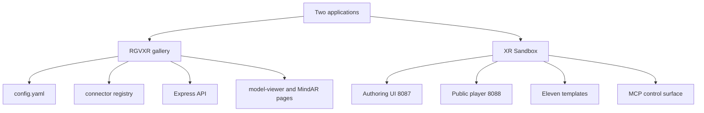
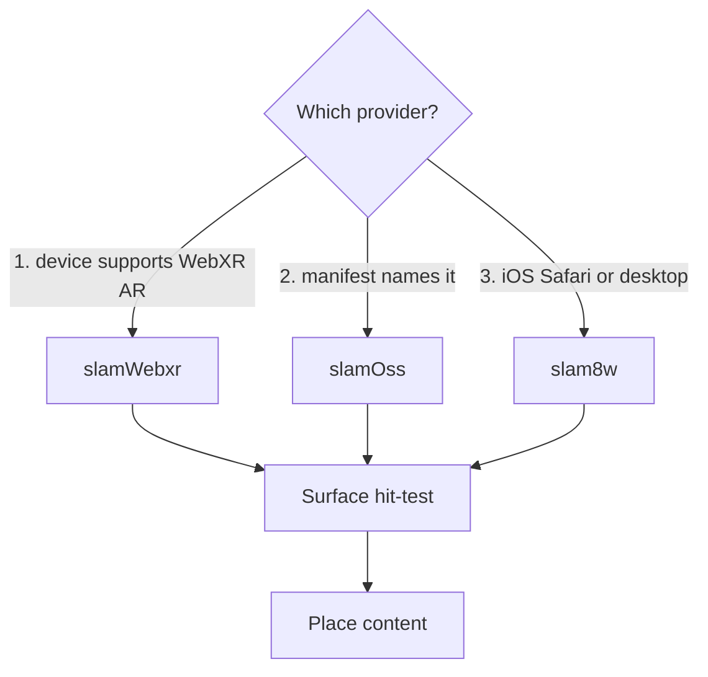
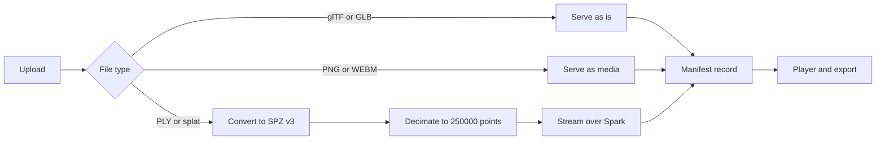
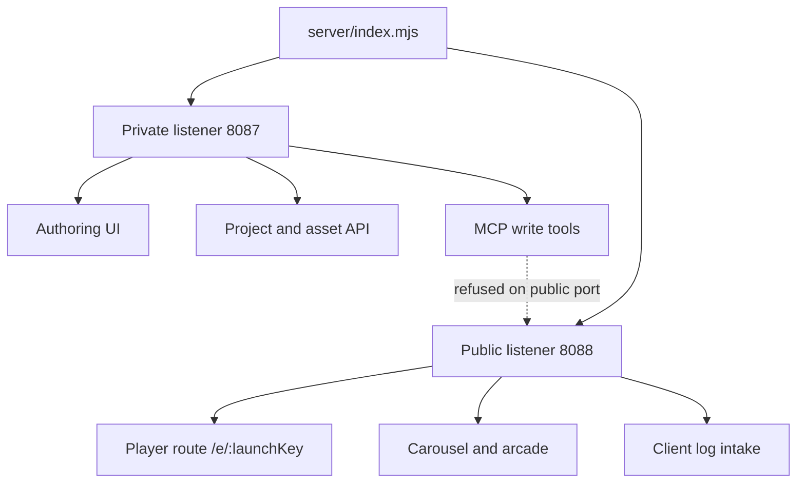
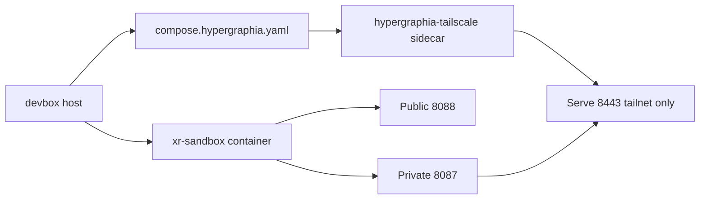

# Hypergraphia XR and AR Stack

Status: verified
Verified: 2026-09-19
Scope: RGVXR platform and XR Sandbox authoring environment

## 1. Purpose

This document describes the XR and AR stack.

It records the two applications, the tracking providers, the content pipeline, the server, and the deploy path.

Every statement below comes from the current source files.

## 2. Two Applications

The stack holds two separate applications. They serve different jobs.

| Application | Root | Job | Stack |
| --- | --- | --- | --- |
| RGVXR | `work/rgvxr` | Show a public AR gallery | Express, A-Frame, model-viewer, MindAR |
| XR Sandbox | `/Users/selfsim/Self-sim/xr-sandbox` | Author, test, and play experiences | React 19, Vite 8, Three.js 0.185, TypeScript |

RGVXR is the public gallery. It holds a connector model and a review workflow.

XR Sandbox is the authoring and playback environment. It holds eleven templates.



## 3. XR Sandbox Templates

The template table lives in `src/experiences/index.ts`. Eleven templates exist.

| Template | Tracking method | Main technology |
| --- | --- | --- |
| `world-slam` | Markerless 6DoF | WebXR hit-test or 8th Wall |
| `gaussian-splat` | World placement | Spark 2.1.0 and SPZ v3 |
| `volumetric-splat` | World placement | Splat animation |
| `marker` | Printed pattern | ARToolkit 0.3.2 |
| `hypergraphia` | Planar image target | MindAR 1.2.5 |
| `image-target` | Planar image target | MindAR 1.2.5 |
| `face-filter` | Face landmarks | MediaPipe 0.10.32 |
| `geo` | Location | Geolocation |
| `holographic-hud` | Camera overlay | Three.js |
| `neural-live` | World placement plus live stream | WebSocket and FlyWire simulation |
| `neural-mapping` | Data field | Three.js |

The `hypergraphia` template shares the image-target module. It is planar image tracking.

## 4. Tracking Providers

The runtime selects one provider. The file `src/runtime/tracking-provider.ts` defines the seam.



The selection order is fixed.

| Priority | Provider | File | When it runs |
| --- | --- | --- | --- |
| 1 | WebXR native | `runtime/slamWebxr.ts` | Android Chrome and Meta Quest |
| 2 | Experimental open source | `runtime/slamOss.ts` | A manifest names it |
| 3 | 8th Wall SLAM | `runtime/slam8w.ts` | iOS Safari and desktop fallback |

The provider answers one question. Where may content stand in the real world?

The experimental provider runs only on an explicit request.

### 4.1 Tracking modules

| Module | File | Function |
| --- | --- | --- |
| Hit test | `runtime/hit-test.ts` | Surface placement |
| Marker | `runtime/marker.ts` | Pattern tracking with a camera matrix |
| Face | `runtime/face.ts` | MediaPipe face landmarks |
| Spark | `runtime/spark.ts` | Gaussian splat rendering |
| Splat animation | `runtime/splat-animation.ts` | Splat motion |
| Tracking | `runtime/tracking.ts` | Shared tracking state |

## 5. Content Pipeline

The library accepts several asset types. The server converts heavy input.



Conversion settings come from `config.yaml`.

| Setting | Value | Meaning |
| --- | --- | --- |
| `targetSplatPoints` | 250000 | Point budget after decimation |
| `spzVersion` | 3 | SPZ container version |
| `maxFileSizeMb` | 100 | Upload limit |
| `concurrency` | 1 | Conversion job count |

Raw source uploads stay private. The server serves only sanitized derivative files.

## 6. Animation System

Animation is manifest data. It is not code.

An experience stays reproducible from its manifest alone.

| Track | Effect |
| --- | --- |
| `spin` | Continuous rotation |
| `float` | Vertical drift |
| `pulse` | Scale cycle |
| `orbit` | Circular path |
| `fade` | Opacity ramp |
| `clip` | glTF animation clip |
| `frames` | Splat video from a frame sequence |
| `reveal` | GPU SDF sweep through a splat cloud |
| `video` | Planar video surface with optional chroma key |

The authoring UI selects animation presets.

## 7. Server

One Express process runs two listeners. They have different trust levels.



| Listener | Port | Tailscale path | Purpose |
| --- | --- | --- | --- |
| Private | 8087 | Serve on 8443 | Authoring, assets, MCP writes |
| Public | 8088 | Funnel on 443 | Playback only |

Write tools are refused on the public port. That port faces the internet.

### 7.1 Server modules

| Module | File | Function |
| --- | --- | --- |
| Entry | `server/index.mjs` | Two listeners and route mounting |
| Projects | `server/projects.mjs` | Project records and assets |
| Playback | `server/playback.mjs` | Player, carousel, targets, arcade |
| Config | `server/config.mjs` | Runtime config with environment override |
| MCP | `server/mcp.mjs` | Agent control surface |
| Live session | `server/live-session.mjs` | Neural simulation sessions |
| Client log | `server/client-log.mjs` | Device error intake |
| Screenshots | `server/screenshots.mjs` | Field captures |
| Imports | `server/imports.mjs` | Asset import jobs |
| Assets | `server/assets.mjs` | Asset serving |
| Carousel | `server/carousel.mjs` | Test carousel |

### 7.2 Main endpoints

| Endpoint | Method | Purpose |
| --- | --- | --- |
| `/health` | GET | Health check |
| `/api/config` | GET | Public platform config |
| `/api/projects` | GET, POST | List and create projects |
| `/api/projects/:id` | GET, PUT | Read and update one project |
| `/api/projects/:id/assets` | POST | Upload an asset |
| `/api/projects/:id/launch` | POST | Mint a launch key |
| `/api/projects/:id/export` | POST | Build a static export |
| `/e/:launchKey` | GET | Play one experience |
| `/carousel` | GET | Test carousel |
| `/target/:name` | GET | Image target file |
| `/mcp` | POST | Agent control |
| `/client-log` | POST | Device error report |
| `/api/screenshots` | GET | Field screenshots |

## 8. Deploy

The devbox runs the stack behind Tailscale.



| File | Project name | State volume | Exposure |
| --- | --- | --- | --- |
| `compose.yaml` | directory basename | `/mnt/storage/xr-library` | Host Tailscale |
| `compose.hypergraphia.yaml` | `hypergraphia` | `/mnt/storage/hypergraphia-*` | Sidecar Serve only |

The Hypergraphia stack uses its own project name and container name. The two stacks stay disjoint.

The sidecar shares the tailnet with the phone. It uses `network_mode: service:hypergraphia-tailscale`.

The sidecar serves the private listener only. It never runs Funnel.

### 8.1 Bring-up commands

```bash
TS_AUTHKEY=tskey-auth-... \
XR_PRIVATE_ORIGIN=https://hypergraphia.tailfceaca.ts.net:8443 \
XR_PUBLIC_ORIGIN=https://hypergraphia.tailfceaca.ts.net:8443 \
TS_HOSTNAME=hypergraphia \
  docker compose -f compose.hypergraphia.yaml up -d --build

docker exec hypergraphia-tailscale \
  tailscale serve --bg --https=8443 http://127.0.0.1:8087

docker exec hypergraphia-tailscale curl -f http://127.0.0.1:8087/health
```

## 9. Licenses and Attribution

| Component | License | Obligation |
| --- | --- | --- |
| 8th Wall engine | Niantic Spatial XR Engine License | Show the runtime attribution banner |
| MindAR | Open source | Keep the notice |
| ARToolkit | Open source | Keep the notice |
| MediaPipe | Apache 2.0 | Keep the notice |
| Three.js | MIT | Keep the notice |
| Meshy assets | CC BY 4.0 | Attribute the author before shipping |

The player shows the 8th Wall attribution banner during a SLAM session.

The build bundles the license file with every static export.

## 10. Verification

Automated smoke suites cover each risky path.

```bash
npm test                      # run every suite
npm test -- marker splat      # filter by name
npm run sim                   # headed Chrome with a synthetic camera
npm run sim -- --camera-file clip.y4m
npm run verify:arcade-models  # vendored model byte and hash check
```

| Suite | Covers |
| --- | --- |
| `smoke-splat.mjs` | SPZ conversion, metadata, streaming |
| `smoke-world-placement.mjs` | WebXR hit-test transitions |
| `smoke-8thwall.mjs` | SLAM delivery and license compliance |
| `smoke-hypergraphia.mjs` | MindAR target execution |
| `smoke-marker.mjs` | Pattern tracking |

Runtime state appears as `data-xr8-*`, `data-anim-*`, and `data-marker-*` attributes. Any automation path can read them.

## 11. Known Gaps

| Gap | Effect | Next action |
| --- | --- | --- |
| Devbox deploy pending | Hypergraphia stack is not live | Run the bring-up commands |
| Media Lab uses raw hex values | Two visual systems exist | Apply the token contract in DESIGN.md |
| Splat asset preview after refresh | Uploads do not reload from the devbox | Add a library read on load |
| USDZ, PLY, and SPLAT placeholders | No loader is wired | Wire the loaders |
| RGVXR metadata fields | The migration drops some fields | Add the adapter |

## 12. References

- [Open XR Sandbox README](/Users/selfsim/Self-sim/xr-sandbox/README.md)
- [Web visualizer runtime design](./superpowers/specs/2026-09-17-web-visualizer-runtime-design.md)
- [Universal identity and component system](./superpowers/specs/2026-09-17-universal-identity-system-design.md)
- [Interface contract](../../../DESIGN.md)
- [RGVXR platform](/Users/selfsim/Documents/Codex/2026-09-15/https-sam-gov-https-sam-gov/work/rgvxr/README.md)
