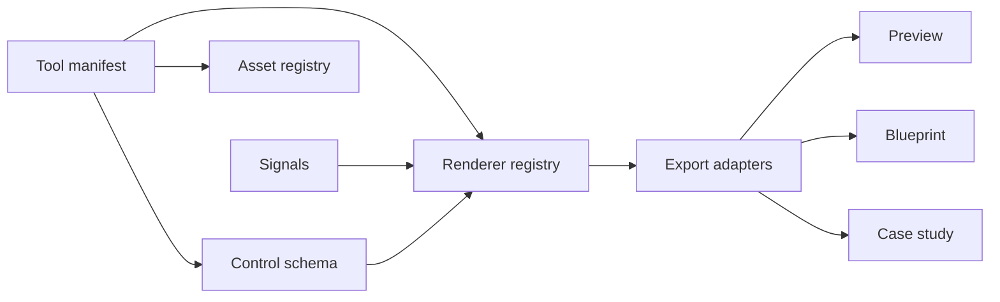

# Modular Visual Tool Platform Research

Status: verified research record
Review date: 2026-09-18
Owner: Hypergraphia Studio

## Purpose

This record compares premium creative-tool platforms with open-source or forkable foundations.

The goal is to build a Hypergraphia system with one visual language, many renderers, typed controls, presets, and export paths.

## Comparison

| Platform | Best reference | Stack or model | License signal | Hypergraphia decision |
| --- | --- | --- | --- | --- |
| [Brik](https://brik.space/gallery) | Premium tool gallery, controls, remix flow, and exports | Dynamic tool records, control schemas, canvas code, previews, and hosted viewer | No public source license found during this review | Use as a product benchmark. Do not copy hosted code or creator assets. |
| [Ghost Arcade Community](https://github.com/riskcapital/ghost-arcade-community) | Projection mapping, live visuals, shaders, 3D, splats, and mobile control | Svelte 5, Three.js, Electron, Vite, TypeScript, WebSocket | AGPL-3.0-or-later | Closest operational reference. Fork only if source-sharing and trademark rules fit. |
| [cables.gl](https://cables.gl/standalone) | Node-based visual authoring and reusable patches | Browser and standalone visual programming with realtime operators and asset import | Standalone page states MIT | Strong reference for the authoring graph and operator model. Verify each patch license. |
| [Theatre.js](https://www.theatrejs.com/) | Professional motion design and timeline editing | JavaScript animation system with React, Three.js, HTML, SVG, and extensions | Core Apache-2.0; Studio AGPL-3.0 | Use the core for production animation. Use Studio during development with its license boundary. |
| [Shader Park](https://shaderpark.com/) | Artist-friendly procedural materials and 2D/3D shaders | JavaScript-to-shader workflow with Three.js and WebGL targets | `shader-park-core` repository states MIT | Good renderer module for Hypergraphia materials and generative surfaces. |
| [Hydra](https://github.com/hydra-synth/hydra) | Live coding, signal routing, feedback, and networked visuals | WebGL framebuffers, chained transforms, WebRTC streams, and a browser editor | Repository states AGPL-3.0 | Use as a live-signal reference. Keep it separate from the core authoring model. |

## Architectural findings

The strongest systems separate five concerns:

1. A tool manifest describes identity, controls, assets, and exports.
2. A renderer consumes state and produces a visual surface.
3. A control schema creates the editor interface.
4. A signal graph maps input data to visual parameters.
5. An export layer creates images, video, embeds, and documentation.

## Fork recommendation

Do not fork Brik as a code base.

Use Brik as the product and interaction benchmark.

Build the Hypergraphia kernel inside the existing XR Sandbox.

Use the following library strategy:

- Use Theatre.js core for authored motion and animation state.
- Use Shader Park core for procedural materials and shader studies.
- Study cables.gl for node and operator composition.
- Study Ghost Arcade for projection, live-performance, and companion-control patterns.
- Study Hydra for signal routing and feedback modes.
- Keep the Hypergraphia manifest as the source of truth.

## License and provenance rules

- Record the license for every dependency and sample asset.
- Keep third-party code in isolated packages with notices.
- Do not copy Brik implementation files or gallery assets without permission.
- Treat creator patches as separate works with separate rights.
- Keep Hypergraphia branding independent from every reference project.
- Recheck license terms before a commercial release or public deployment.

## Phase decision

The first Hypergraphia tool suite should combine:

- A Theatre-style motion timeline.
- A cables-style operator graph.
- A Shader Park-style material layer.
- A Ghost Arcade-style projection output.
- A Hydra-style signal and feedback mode.
- Brik-style controls, presets, previews, and exports.

This produces one modular identity without forcing every project into one renderer.

## Sources

- [Brik gallery](https://brik.space/gallery)
- [Ghost Arcade Community repository](https://github.com/riskcapital/ghost-arcade-community)
- [Ghost Arcade contributing guide](https://github.com/riskcapital/ghost-arcade-community/blob/main/CONTRIBUTING.md)
- [cables.gl standalone](https://cables.gl/standalone)
- [cables.gl about](https://cables.gl/about)
- [Theatre.js](https://www.theatrejs.com/)
- [Theatre.js repository and license](https://github.com/theatre-js/theatre)
- [Shader Park](https://shaderpark.com/)
- [Shader Park core repository](https://github.com/shader-park/shader-park-core)
- [Hydra repository](https://github.com/hydra-synth/hydra)
