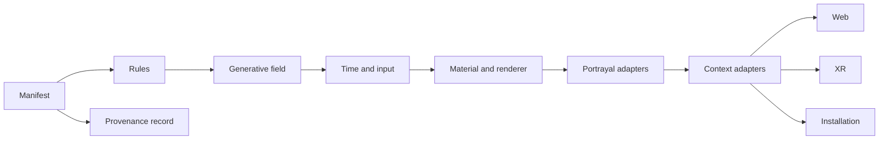

# Hypergraphia Generative Lab Readiness Roadmap

Status: planning baseline
Review date: 2026-09-17
Owner: Hypergraphia Studio

## Executive assessment

The current lab is a credible browser prototype.

It is not yet an installation-ready generative media system.

The next target is a visual systems alpha with stronger motion, materials, inputs, and capture records.

## Maturity model

| Level | Name | Meaning |
| --- | --- | --- |
| L0 | Concept | Identity principles and references exist. |
| L1 | Browser prototype | Controls and seeded visual studies work in a browser. |
| L2 | Visual systems alpha | Motion, materials, and generator families feel authored. |
| L3 | Portrayal beta | Objects, images, video, and splats enter the same structure. |
| L4 | Installation pilot | Data, sound, sensors, and hardware outputs work in one scene. |
| L5 | Public production | The system passes performance, accessibility, documentation, and deployment review. |

Current level: **L1**.

Near target: **L2**.

Long-term target: **L4**, then **L5** for selected public projects.

## Baseline and target measures

Scores use a five-point internal scale.

The scores guide work. They do not represent external awards or market rankings.

| Capability | Current | L2 target | Evidence required |
| --- | ---: | ---: | --- |
| Identity grammar | 3.0 | 4.0 | One manifest drives multiple configurations. |
| Generator breadth | 2.0 | 3.5 | Five or more authored generator families. |
| Motion quality | 1.5 | 4.0 | Continuous deformation, turbulence, and layered timing. |
| Material quality | 1.5 | 3.5 | Shader materials, trails, particles, and depth cues. |
| Input systems | 0.5 | 2.5 | Audio or data input changes the scene. |
| Portrayal adapters | 0.5 | 3.0 | Mesh, image, video, and splat adapters share one contract. |
| Interaction | 1.5 | 3.0 | Camera, pointer, keyboard, and one external input work together. |
| Capture and provenance | 1.0 | 3.5 | PNG and JSON records reproduce the same state. |
| XR boundary | 0.5 | 2.5 | A separate adapter passes a controlled XR test scene. |
| Installation readiness | 0.5 | 2.0 | Frame budget, output routing, and recovery states exist. |
| Documentation | 3.0 | 4.0 | Research, manifests, source notes, and test records stay current. |

## Target architecture

The manifest defines the stable identity contract.

The field defines the spatial grammar.

Time and input define change.

Materials define visual depth.

Portrayal adapters place objects inside the structure.

Context adapters target websites, XR, and physical installations.

Provenance records preserve repeatability.

## Phase sequence

### Phase 1 — Motion grammar

Goal: replace slow group rotation with authored motion.

Deliverables:

- Curl-noise or vector-field deformation.
- Multi-scale movement with slow, medium, and fast bands.
- Motion controls that affect geometry, not only object rotation.
- Stable output for a fixed seed and parameter record.
- Reduced-motion behavior that keeps the scene legible.

Exit test: a 20-second capture shows visible structural change without visual noise.

### Phase 2 — Material grammar

Goal: create a richer visual surface without adding random decoration.

Deliverables:

- Shader material library.
- Trails and particles for selected generator families.
- Instanced geometry for repeated objects.
- Depth, glow, and transparency rules with a render budget.
- Dark and light theme checks for the editorial shell.

Exit test: one representative scene reads as a designed work, not a debug study.

### Phase 3 — Input grammar

Goal: connect the field to meaningful signals.

Deliverables:

- Audio-reactive input with a local fallback.
- Data input adapter for heritage or environmental datasets.
- Optional OSC or MIDI input for live performance tests.
- Input smoothing and range mapping.
- Input provenance in the capture record.

Exit test: one input changes motion, material, or density in a repeatable way.

### Phase 4 — Portrayal adapters

Goal: place authored content inside the identity structure.

Deliverables:

- Mesh adapter for GLB or procedural objects.
- Image and video adapter for case studies.
- Gaussian splat adapter for scanned objects.
- Shared transform, scale, lighting, and interaction contract.
- Fallback state when an asset fails to load.

Exit test: the same field presents a mesh and a scanned object without a layout rewrite.

### Phase 5 — XR and installation pilot

Goal: transfer the system into controlled physical output.

Deliverables:

- Separate WebXR adapter.
- Image-target or marker entry test.
- Fixed-resolution display output test.
- Audio routing and timing test.
- Recovery states for asset, sensor, and network failure.

Exit test: a small pilot runs for a complete session without manual reload.

### Phase 6 — Public production

Goal: prepare a documented proposal or public installation.

Deliverables:

- Site and audience requirements.
- Accessibility and safety review.
- Performance evidence at the target resolution.
- Asset licenses and source records.
- Installation drawings, signal flow, and maintenance notes.
- Case study with process, budget class, team roles, and outcomes.

Exit test: a partner can review the proposal without reading source code.

## First implementation slice

The first build should target Phase 1 and a small part of Phase 2.

It should use the current flow preset as the test scene.

It should add field deformation, trails, and a JSON capture record.

It should not add a full Gaussian splat pipeline before the motion grammar works.

## Quality gates

- Keep the identity grammar separate from project content.
- Use seeded state for every published study.
- Record renderer and generator versions.
- Respect reduced motion.
- Check desktop and mobile layouts.
- Check dark and light themes.
- Check frame time before adding visual effects.
- Keep source links beside research claims.
- Mark simulated inputs as simulated.
- Do not call a prototype installation-ready.

## Decision record

The system will keep one Hypergraphia identity for the current phase.

Projects will reconfigure the grammar through manifests.

The system will support mesh, splat, video, image, and data portrayals.

The system will use its own visual language rather than imitate another studio.
