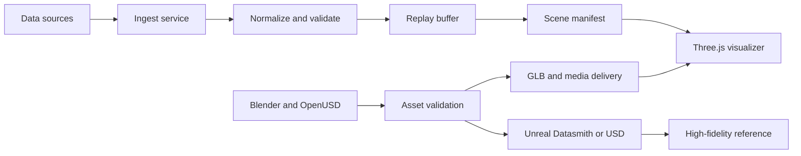

# Hypergraphia Web Visualizer and Data Runtime

Status: revised draft for review
Review date: 2026-09-17
Owner: Hypergraphia Studio

## Goal

Create a web-based, scale-aware visualizer for Hypergraphia case studies and installation prototypes.

The visualizer must show how a generative field, a portrayed object, and a physical context work together.

The system must remain interoperable with Blender, OpenUSD, Unreal Engine, Three.js, and XR Sandbox.

The first environment is a room-scale media lab.

## Design principle

The data stream sculpts the scene through a controlled manifest.

The stream changes field parameters, materials, camera behavior, and narrative states.

The stream does not write uncontrolled geometry.

The identity grammar remains stable while each project receives a different scene configuration.

## Scope

### In scope

- Browser visualizer.
- Room, floor, ceiling, wall, and human-scale references.
- LED wall and projection surfaces.
- Projector frustum simulation.
- XR camera and target-marker simulation.
- Mesh, image, video, and Gaussian splat portrayal adapters.
- Case-study metadata and scene notes.
- Data-stream preview controls.
- JSON manifest capture and deterministic replay.
- Node and TypeScript backend services.

### Out of scope for the first slice

- Unreal runtime shipping.
- Live hardware control.
- Public sensor deployment.
- Full production database.
- Automated Blender or Unreal export jobs.
- Final Gaussian splat quality tuning.
- Multi-user editing.

## Interoperability model

| Tool | Primary role | Contract |
| --- | --- | --- |
| Blender | Modeling, scans, materials, cameras, and scale | `.blend`, USD, GLB |
| OpenUSD | Scene assembly and layered authoring | `.usd`, `.usda`, `.usdc` |
| Unreal Engine | High-fidelity architectural and installation preview | Datasmith and USD |
| Three.js | Browser visualizer and web XR preview | glTF, GLB, video, textures |
| XR Sandbox | Runtime manifests, tracking, live sessions, and splats | JSON, GLB, PLY, SPZ |

OpenUSD remains an authoring and assembly format.

glTF and GLB remain the web delivery format.

Unreal remains a high-fidelity reference runtime.

Three.js remains the first implementation runtime.

Gaussian splats remain a separate SPZ delivery branch.

The browser must not treat USD or Datasmith files as runtime assets.

## System architecture



The first slice renders only in Three.js.

Unreal receives an offline export profile later.

The manifest does not enter Unreal during the first slice.

## Visualizer model

The visualizer uses a meter-based scene root.

The first room measures 6 metres wide, 4 metres deep, and 3 metres high.

One Three.js unit represents one metre.

The scene includes these primitives:

- `SceneRoot` — project coordinate system in meters.
- `RoomShell` — floor, walls, ceiling, and scale guides.
- `HumanReference` — neutral reference figures for scale.
- `DisplaySurface` — LED wall, projection plane, or screen.
- `ProjectorFrustum` — throw distance, angle, and coverage preview.
- `CameraRig` — audience, documentation, and XR viewpoints.
- `ObjectAnchor` — location, scale, orientation, and portrayal binding.
- `XRTarget` — image target, marker, or tracked surface.
- `DataField` — visible field showing the active stream response.
- `CaseStudyPanel` — source, process, collaborators, and status.

The first release uses simple boxes, planes, cylinders, grids, and transparent frustums.

It does not use CAD geometry in the first release.

The canonical frame uses metres, a right-handed coordinate system, Y-up, and an origin at the room floor center.

The room uses X for width, Y for height, and Z for depth.

The front wall sits at positive Z.

The display surface center defines the local origin for its content adapter.

The projector pose defines the frustum apex.

## Visualizer modes

| Mode | Purpose |
| --- | --- |
| Plan | Show dimensions, anchors, and installation layout. |
| Stage | Show the designed room and audience view. |
| Projection | Show projector frustum and surface coverage. |
| XR | Show target markers, camera, and anchored objects. |
| Data | Show live parameters, event history, and replay state. |

## Projection and LED simulation

Projector controls include power, throw distance, beam angle, beam opacity, and target surface.

The renderer shows a transparent cone and a surface highlight.

The simulation does not claim lumen output, lens shift, keystone correction, blending, or photometric accuracy.

LED controls include power, brightness, tile count, content source, and seam visibility.

The renderer shows an emissive tiled plane.

The simulation does not claim nit output, pixel pitch, refresh rate, or vendor compatibility.

## XR simulation

The desktop visualizer uses `?xr=sim` for a clearly simulated XR path.

The simulation provides Inspect, Place, and Reset actions.

The interface must show `XR SIMULATION / FAKE SURFACE / NO DEVICE TRACKING`.

Real WebXR support must use `navigator.xr.isSessionSupported()`.

Desktop pointer movement must never appear as real SLAM.

## Runtime stack

### Frontend

- React and Vite for the visualizer application.
- TypeScript for scene and event contracts.
- Three.js for browser rendering.
- WebGL for the first renderer.
- WebGPU as a later renderer option.
- Hypergraphia CSS tokens for interface consistency.

The current Hypergraphia lab uses Three.js `0.160`.

The XR Sandbox uses Three.js `0.185`.

MindAR and model-viewer remain isolated runtimes.

### Backend

- Node and TypeScript for service orchestration.
- Express for project, asset, and manifest routes.
- WebSocket for live events.
- Zod for event and manifest validation.
- JSONL for capture and replay in the first slice.
- SQLite or PostgreSQL only after query requirements emerge.
- Python workers for data transformation and scientific datasets.

### Existing integration surface

The XR Sandbox is the canonical runtime host for the first slice.

The runtime uses its resolved Three.js `0.185.1` version.

The Hypergraphia site remains the presentation and launch shell.

The legacy `work/rgvxr` build remains a case-study reference.

It does not share Three.js objects with the new runtime.

The XR Sandbox contains Node, TypeScript, Express, WebSockets, Zod, Three.js, React, Vite, Python simulation support, and splat dependencies.

MindAR remains isolated at its vendored Three.js version.

Model-viewer remains isolated in its native handoff document.

The local service binds to localhost by default.

The service uses an explicit origin allowlist.

Asset routes allow only manifest-listed public derivatives.

The service rejects path traversal and private source-asset requests.

Capture writes use a temporary file and an atomic rename.

## Data contract

```json
{
  "schemaVersion": 1,
  "eventId": "evt-00001042",
  "manifestId": "media-lab-room-01",
  "source": "heritage-dataset",
  "sourceVersion": "0.1.0",
  "eventTime": "2026-09-17T00:00:00Z",
  "ingestTime": "2026-09-17T00:00:00Z",
  "sequence": 1042,
  "stream": {
    "status": "LIVE",
    "rateHz": 12,
    "latencyMs": 80,
    "staleAfterMs": 2000,
    "frozen": false
  },
  "signals": {
    "density": 0.62,
    "motion": 0.48,
    "depth": 0.71,
    "scale": 1.0
  },
  "scene": {
    "id": "river-pierce-study",
    "generator": "field-structure",
    "seed": 42,
    "version": "0.2.0"
  }
}
```

The renderer consumes normalized signals.

The manifest records the mapping from signal to visual parameter.

The first manifest uses this minimum shape:

```json
{
  "manifestId": "media-lab-room-01",
  "manifestVersion": 1,
  "units": "meters",
  "upAxis": "Y",
  "handedness": "right",
  "origin": "room-floor-center",
  "room": { "width": 6, "depth": 4, "height": 3 },
  "anchors": {
    "led-wall": { "position": [0, 1.5, 1.8], "size": [4, 2.25] },
    "projection-surface": { "position": [0, 1.5, -1.8], "size": [4, 2.25] },
    "projector": { "position": [0, 2.8, 0], "target": "projection-surface" },
    "content-object": { "position": [0, 0.3, 0], "scale": 1 }
  },
  "assets": [{ "id": "content-object", "adapter": "glb", "source": "fixture.glb" }],
  "mappings": {
    "density": { "target": "content-object.scale", "range": [0.6, 1.4] },
    "motion": { "target": "data-field.rate", "range": [0, 1] }
  }
}
```

The manifest rejects missing units, axes, room dimensions, anchor names, asset adapters, and mapping ranges.

The replay buffer preserves the original event sequence.

The runtime accepts only `WAITING`, `LIVE`, `STALE`, `ENDED`, and `ERROR` stream states.

The `STALE` state freezes the last valid sample and reports its timestamp.

The `ERROR` state reports the validation failure without changing the last valid scene.

The WebSocket and JSONL replay paths use this same serialized event envelope.

The service rejects unknown schema versions, invalid numbers, and out-of-range signals.

The service ignores duplicate sequences and reports out-of-order events.

The service enters `STALE` after `staleAfterMs` and resumes `LIVE` after a valid event.

The service enters `ENDED` after an explicit stream close.

The service records a virtual replay clock for deterministic playback.

## Asset contract

Every portrayal adapter must expose:

- `load(source, options)` returning a promise.
- `dispose()`.
- `setTransform(transform)`.
- `setSignalState(signals)`.
- `getBounds()`.
- `getMetadata()`.
- `getFallbackState()`.

The load options include an abort signal and an asset hash.

The adapter owns resources until `dispose()` runs.

Bounds use the canonical room frame.

Fallback states distinguish missing, blocked, invalid, and cancelled assets.

This contract supports mesh, image, video, and Gaussian splat content.

GLB is the canonical browser mesh contract.

USD and Datasmith remain source or high-fidelity interchange formats.

SPZ v3 is the preferred Gaussian splat delivery format for the current XR Sandbox runtime.

Original PLY, SPLAT, and SPZ files remain private source assets.

Splat assets must not be converted into GLB or USDZ.

## First implementation slice

The first slice must create one room-scale media lab in the XR Sandbox host.

It must include one GLB object, one video surface, one projector frustum, one XR target, and one deterministic local data field.

It must include plan, stage, projection, XR, and data modes.

It must capture a JSON scene state beside a visual capture.

It must replay the same scene from the same manifest.

It must keep the backend local and private during development.

It must label simulated projector and XR behavior as illustrative.

It must label case-study status as `VERIFIED`, `PROTOTYPE`, or `PROPOSED`.

The first slice does not include live network streams, hardware control, SPZ rendering, or Unreal export.

The first slice uses one pinned Three.js version, one manifest, and one fixture asset set.

The first slice captures a canonical state hash from the manifest, asset hashes, seed, virtual clock, camera transform, viewport, renderer version, and last event sequence.

Replay verification compares canonical state hashes before visual pixel comparison.

## Verification

### Functional

- Load a scene manifest.
- Validate an event with Zod.
- Replay a JSONL event sequence.
- Change field parameters from the data stream.
- Load a GLB object.
- Load a video surface.
- Display projector coverage.
- Display an XR target marker.
- Capture and restore scene state.
- Keep `STALE` state frozen at the last valid sample.
- Keep fake XR placement separate from real device tracking.

### Visual

- Verify meter scale.
- Verify human reference proportions.
- Verify projection frustum alignment.
- Verify camera framing.
- Verify object bounds.
- Verify data-field legibility.
- Verify dark and light themes.
- Verify mobile fallback.
- Verify plan, front, and perspective views agree.
- Verify projector coverage reaches the selected surface.
- Verify LED dimensions preserve aspect ratio.

### Performance

- Record frame time.
- Record draw calls.
- Record GPU memory when available.
- Record asset load time.
- Record event-to-render latency.
- Test graceful behavior when the stream pauses.

The first stream remains deterministic and local.

It exposes source, seed, rate, intensity, latency, freeze, reset, capture, and status controls.

## Risks

- Three.js version drift can break shared adapters.
- USD is stronger for authoring than browser delivery.
- Splat renderers have different coordinate and material behavior.
- Projector simulation needs real hardware measurements later.
- Browser rendering cannot represent every Unreal material.
- Live data requires smoothing and replay controls.
- High scene fidelity can reduce mobile XR performance.

## Reference basis

The interoperability plan follows the Khronos glTF runtime model and Three.js loader guidance.

The authoring plan follows Blender OpenUSD documentation and Unreal Datasmith interoperability guidance.

The visual direction studies Refik Anadol Studio, Universal Everything, FIELD, Marshmallow Laser Feast, Squidsoup, teamLab, and Moment Factory.

The generative identity studies Generative Gestaltung, Hartmut Bohnacker, TwoPoints.Net, Flexible Visual Systems, and Hyperobjects Workbench.

The source links remain external references, not runtime dependencies.

- [Khronos glTF](https://www.khronos.org/gltf/)
- [glTF 2.0 specification](https://registry.khronos.org/glTF/specs/2.0/glTF-2.0.html)
- [Three.js GLTFLoader](https://threejs.org/docs/pages/GLTFLoader.html)
- [Three.js WebXRManager](https://threejs.org/docs/pages/WebXRManager.html)
- [Blender USD manual](https://docs.blender.org/manual/id/5.0/files/import_export/usd.html)
- [OpenUSD documentation](https://openusd.org/dev/index.html)
- [Unreal Datasmith import](https://dev.epicgames.com/documentation/unreal-engine/importing-datasmith-content-into-unreal-engine)
- [Unreal Datasmith software guides](https://dev.epicgames.com/documentation/unreal-engine/datasmith-software-interop-guides-for-unreal-engine)
- [Refik Anadol Studio](https://refikanadolstudio.com/studio/)
- [Generative Gestaltung 2](http://www.generative-gestaltung.de/2/)
- [Flexible Visual Systems](https://flexiblevisualsystems.info/)
- [Hyperobjects Workbench](https://hyperobjects.design/workbench)

## Acceptance criteria

- One room scene opens in the browser.
- The scene uses meter-based coordinates.
- A human reference shows scale.
- A projector frustum shows coverage.
- A data stream changes the field.
- A GLB object appears at a known anchor.
- An XR target appears at a known anchor.
- A video surface appears on a known plane.
- The same manifest reproduces the same scene.
- The visualizer records a JSON state.
- The runtime reports clear fallback states.

## Next decision

Select the first recorded data stream before implementation.

The recommended source is a heritage or environmental dataset.
